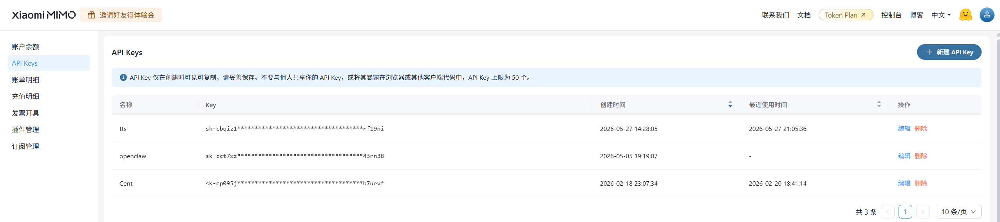
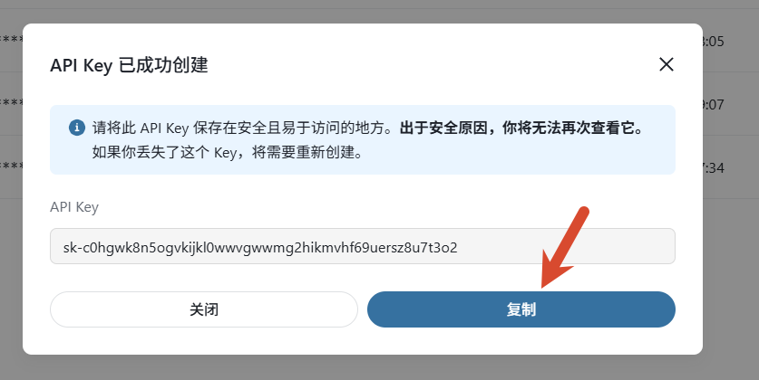
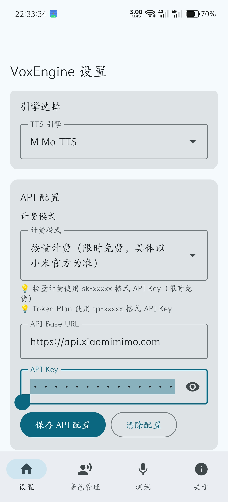
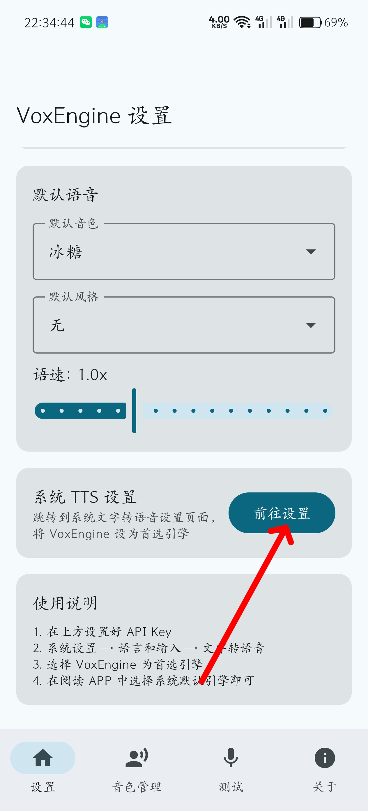
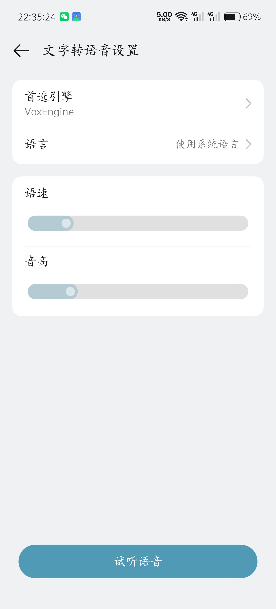
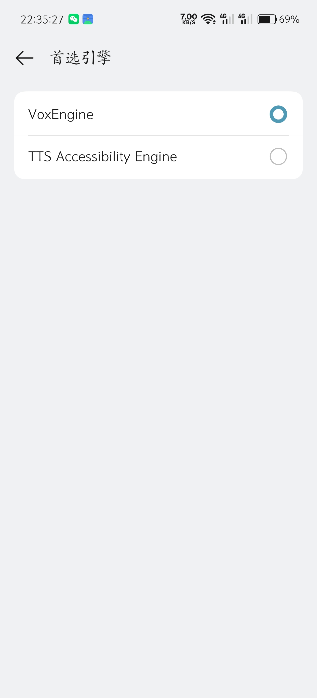

# VoxEngine

English · [中文](README.md)

VoxEngine is an Android **system-level TTS speech synthesis engine** with pluggable engine switching, voice cloning, and voice design. Once registered as a system TTS service, it can be used directly by any app that relies on the Android system TTS API (such as the Legado reader).

## Also reading novels? Try 阅读 Vox

If, besides text-to-speech, you also need complete novel-reading features — online book sources, local reading, AI chapter summaries, AI rewriting, multi-character voice acting, listening cache, and more — check out [阅读 Vox (Legado Vox)](https://github.com/Autsunset/legado-vox). It is a standalone reader and listening app developed as a fork of Legado and legado-with-MD3.

- [Project homepage & details](https://github.com/Autsunset/legado-vox)
- [Download 阅读 Vox APK](https://github.com/Autsunset/legado-vox/releases)

阅读 Vox and VoxEngine are independent projects; installing or using 阅读 Vox does not depend on VoxEngine. 阅读 Vox can configure MiMo cloud TTS directly from within the app; if VoxEngine is already installed, you can set it as the Android system TTS and use it from 阅读 Vox or any other app.

## Features

- **Pluggable engine architecture** — unified interface design; currently supports MiMo TTS and Microsoft Edge TTS, with room to add more engines
- **Preset voices** — built-in Chinese and English voices (Bingtang, Moli, Soda, Birch, Mia, Chloe, etc.), ready to use out of the box
- **Automatic voice language detection** — the system TTS reports its language based on the current default voice: English voices report English, Japanese voices report Japanese, and everything else reports Chinese
- **Voice cloning** — upload or record an audio sample to faithfully reproduce a target voice
- **Voice design** — generate a custom voice from a text description, no audio file required
- **Style control** — supports emotion, tone, dialect, role-play, and other style labels to switch pronunciation styles in a single step
- **System TTS integration** — runs as an Android `TextToSpeechService`, usable by any app that supports system TTS
- **Built-in reading bookshelf** — import local TXT and EPUB novels, read by chapter/table of contents, and save reading progress
- **Built-in listening** — start listening from the current page or a selected paragraph, synthesizing in order and pre-caching subsequent content
- **Listening stability optimizations** — re-synthesizes the current segment if prefetching fails, avoiding skipped segments during network jitter; progress is not saved early before audio finishes playing
- **Clone voice throttling settings** — the request interval, retry count, and retry wait for clone/design voices can be adjusted in the reader settings
- **Log query & export** — query logs by date, time range, level, and keyword; copy or export the results
- **Voice import/export** — export custom voices to JSON files for easy backup and sharing

## Illustrated Tutorial

### 1. Register on the MiMo platform

Go to the [Xiaomi MiMo TTS platform](https://platform.xiaomimimo.com?ref=S5T7WV), register an account, and create an API Key in the console.

MiMo offers two billing modes:

| Billing mode | API Key format | Description |
|--------------|----------------|-------------|
| Pay-as-you-go | `sk-xxxxx` | Free for a limited time, billed per call |
| Token Plan | `tp-xxxxx` | Requires purchasing a Token plan; China / Singapore / Europe nodes available |

> New users are recommended to use **pay-as-you-go** billing (currently free for a limited time); the API Key starts with `sk-`.



### 2. Copy the API Key

After creating it, copy the API Key.



### 3. Enter the API Key in VoxEngine

Open VoxEngine → Settings page, choose the billing mode, enter the API Key, and tap "Save API Configuration". Then pick your preferred default voice and style.



### 4. Open the system TTS settings

On the VoxEngine settings page tap "Go to Settings" to jump to the system text-to-speech settings page.



### 5. Switch the preferred engine (step one)

In the system TTS settings, tap "Preferred engine".



### 6. Select VoxEngine (step two)

Select **VoxEngine** from the engine list. Done!



Now any app that supports system TTS (such as 阅读 Vox) can use VoxEngine directly for speech synthesis.

> Using it in 阅读 Vox: make sure VoxEngine is set as the system default engine, then open 阅读 Vox → reading screen → reading settings → engine & voice, and select the corresponding system TTS.

## Built-in Reading & Listening

VoxEngine also includes a simple bookshelf where you can import multiple local TXT or EPUB novels. For EPUB, chapters are generated from the in-book table-of-contents titles and the spine body order, and the XHTML body is extracted for reading and listening. On the reading screen, tap the middle to show the top/bottom menus, which support table-of-contents navigation, left/right page turns, listening from a selected paragraph, timed stop, and stop after a number of chapters.

Built-in listening uses sequential synthesis with prefetch caching: while playing the current content it first preloads the rest of the current chapter in order, then gradually increases the prefetched page count of the next chapter after each page is finished. If the network jitters or prefetching fails, it re-synthesizes the current segment where playback is, minimizing skipped segments. Clone/design voice request interval and retry parameters can be tuned to reduce the chance of 429 throttling.

## Voices

### Preset voices (recommended)

> Preset voices work out of the box and give the best results. Preset voices also support custom style labels, so you can freely combine tone, emotion, dialect, and other styles.

| Voice | Description |
|-------|-------------|
| Bingtang | Sweet cute female |
| Moli | Gentle graceful female |
| Soda | Energetic sunny male |
| Birch | Deep magnetic male |
| Mia | English female |
| Chloe | English female |
| Milo | English male |
| Dean | English male |

### Voice cloning

Upload or record a reference audio clip (3-10 seconds recommended). MiMo clones a similar voice based on the audio features. Ideal for reproducing a specific character's voice.

> The quality of custom voices (clone/design) depends on the input material and description, and may require several rounds of tuning to achieve the desired result.

### Voice design

Generate a custom voice from a text description, for example:
- "A gentle, magnetic middle-aged male voice"
- "A lively, cute girl's voice"
- "A low, husky narration voice"

## Supported Styles

| Type | Examples |
|------|----------|
| Basic emotions | Happy, Sad, Angry, Fearful, Excited, Calm, Cold |
| Compound emotions | Melancholy, Gratified, Helpless, Guilty, Relieved, Moved |
| Overall tone | Gentle, Aloof, Lively, Serious, Languid, Deep, Capable |
| Voice character | Magnetic, Mellow, Bright, Ethereal, Sweet, Hoarse |
| Character tones | Baby-voice, Elegant-lady, Boyish, Uncle, Taiwan-accent |
| Dialects | Cantonese, Sichuan-dialect |
| Other | Whisper, Singing |

You can choose a default style in the settings. To avoid the engine reading the prompt itself, the app no longer appends `(style)` to the body text. The system TTS language is reported automatically based on the current default voice: English content is best paired with an English voice, and Japanese content is best paired with an Edge Japanese voice.

## Logs

The Logs page supports querying by date, time range, level, and keyword; results can be copied or exported. The app automatically redacts audio base64 data in the logs to avoid overly long logs or leaking audio content.

## Token Plan Nodes

If you use Token Plan, you can choose from the following nodes:

| Node | URL |
|------|-----|
| China | `https://token-plan-cn.xiaomimimo.com` |
| Singapore | `https://token-plan-sgp.xiaomimimo.com` |
| Europe | `https://token-plan-ams.xiaomimimo.com` |

> Token Plan may be restricted to programming/development scenarios. Connecting it to third-party apps for speech synthesis may violate Xiaomi's terms of service and lead to account suspension. Pay-as-you-go billing is recommended.

## Tech Stack

- **Language**: Kotlin
- **UI**: Jetpack Compose + Material 3
- **Storage**: Room + DataStore
- **Network**: OkHttp
- **Audio**: Android AudioTrack
- **Minimum version**: Android 8.0 (API 26)

## Build

```bash
# Debug build
./gradlew assembleDebug

# Release build (requires signing configuration)
./gradlew assembleRelease
```

## Disclaimer

This software is an open-source project intended for learning and personal use only. Any illegal or improper use is strictly prohibited. By using this software you acknowledge that you have read and agree to the [MiMo User Agreement](https://platform.xiaomimimo.com/docs/terms/user-agreement) and the [MiMo Privacy Policy](https://privacy.mi.com/XiaomiMiMoPlatform/zh_CN/).

## Acknowledgements

- [MiMo TTS](https://platform.xiaomimimo.com?ref=S5T7WV) — Xiaomi MiMo speech synthesis API

## License

This project is open-sourced under the [MIT License](LICENSE).
